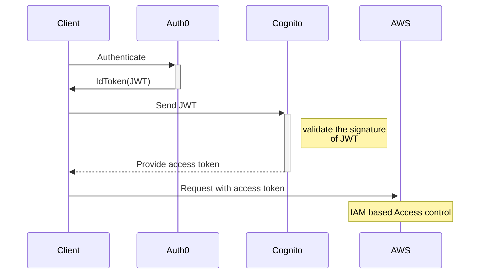

This repository showcases Cognito Authentication using Auth0 as OpenID Connect Provider. Built with CDK

- Cognito Identity Pool is used for IAM role based access control. In this PoC, the access token provided by Cognito is used for accessing protected API
- Client uses amplify-js to authenticate client(passing Auth0 credentials to Cognito) and access protected API. If you prefer other options see [this](https://docs.aws.amazon.com/cognito/latest/developerguide/open-id.html)


https://user-images.githubusercontent.com/6277118/182666081-5d1d8a98-af09-4ef4-b93d-dccf26948901.mov

# Flow



# Setup
### Backend

- Setup Auth0 account
- Generate thumbprint from your identity provider (https://your_account.auth0.com)

  - See https://docs.aws.amazon.com/IAM/latest/UserGuide/id_roles_providers_create_oidc_verify-thumbprint.html

- Run command below to setup Open ID Connect on Cognito Identity Pool

```
YOUR_NAME={Your CDK Stack name} \
AUTH0_CLIENT_ID={Auth0 client id} \
AUTH0_PROVIDER_URL={provider url  e.g https://{your auth0 app id}.auth0.com}\
AUTH0_THUMBPRINT={thumbprint}} \
yarn cdk:deploy
```

### Client

- set up your env (see `client/.env.sample` for example)

- Run command below

```
cd client
yarn install
yarn start
```

# References

- General guide
  - https://auth0.com/docs/customize/integrations/aws/amazon-cognito
